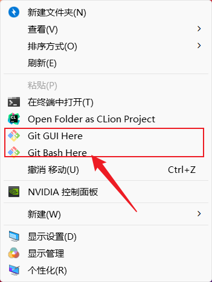
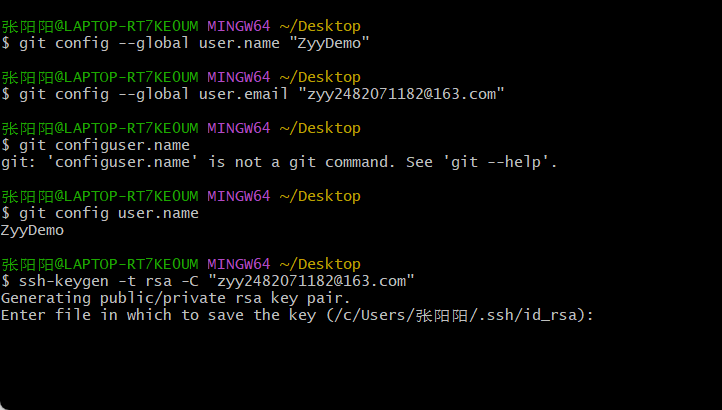
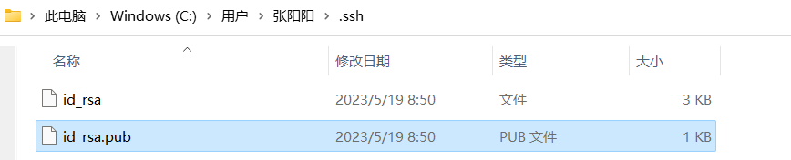
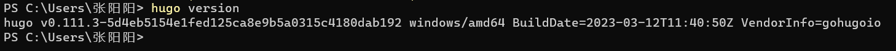

## **环境搭建**

### 一.安装git

以win10为例

1.注册git账号：https://github.com/并记住用户名和密码

2.下载地址：[Git - Downloads (git-scm.com)](https://git-scm.com/downloads)鼠标右键显示Git Bash Here就表示安装Git成功了。



3.设置本地git用户

- ```shell
  git config --global user.name "Your Name"
  ```

- ```shell
  git config --global user.email "邮箱"
  ```

是否已经登录

- ```shell
  git config user.name
  ```

生成密钥

- ```
  ssh-keygen -t rsa -C "邮箱"
  ```



 *将其中Your Name替换为用户名,邮箱替换为自己注册时的邮箱*

如图所示，密钥已经给我们生成到**C:/Users/UserName/.shh/id_rsa**文件下了。

打开该目录下的**id_rsa.pub**文件，用记事本打开并复制这个密钥。



4.去GitHub上验证

登录github ->进入设置->SSH and GPG key ->新建密钥，把上面文件里的内容全部复制粘贴进去即可。


在Git Bash里输入`ssh -T git@github.com` ，成功的话会出现

 You’ve successfully authenticated, but GitHub does not provide shell access.。

### 二.安装choco

[Chocolatey](https://gitee.com/link?target=https%3A%2F%2Fchocolatey.org%2F)是Windows平台上的包管理器，通过它可以集中安装、管理、更新各种各样的软件。

打开Windows PowerShell，用管理员登录，运行下面代码：

```
Set-ExecutionPolicy Bypass -Scope Process -Force; iex ((New-Object System.Net.WebClient).DownloadString('https://chocolatey.org/install.ps1'))
```

查看版本号判断是否安装成功或生成**C:\ProgramData\chocolatey**目录（这个目录是隐藏的）

```shell
choco
```


### 三.安装hugo

在Windows PowerShell中运行以下命令

```shell
choco install hugo -confirm
```

验证是否成功

```shell
hugo version
```



### 四.安装Typora

下载安装即可，非常简单

网上搜索安装即可，安装Typora的目的是编写md文件，也可以用vscode等。

到这里环境就搭建好了。

## **使用hugo搭建博客**

###  一.新建站点

```
hugo new sit Bearcat
cd Bearcat
```

### 二.下载主题：

```
git clone https://github.com/nunocoracao/blowfish.git themes/blowfish
```

### 三.配置Blowfish

之所以选了主题用Blowfish是因为文档，它有我在一众hugo主题里见过最齐全的文档了：https://blowfish.page

配置主题的时候没必要看着文档一点点来，把对应主题下的exampleSite下的配置文件拿出来改改就好。
 改的时候可以开着本地环境，打开无痕浏览，一边改一边看效果。

### 四.git同步

```
rm -rf themes/blowfish/ 
git init .
git submodule add -b main https://github.com/nunocoracao/blowfish.git themes/blowfish
git remote add origin git@github.com:LesserCat/LesserCat.git
git add .
git commit -m "init"
git push -u origin main
```

这之前当然是要配基础环境到git,太基础就不写了。

### 五.Github Action

在仓库的Actions里添加workflow Actions -> New workflow -> 搜索hugo -Configure -> Commit changes

然后等待action完成即可访问

**UPDATE:** 此时虽然能访问，但在actions的任务里总有一个pages build and deployment的任务是失败，还失败的莫名其妙

需要去项目的设置里把部署方从Depoly from a branch式改成Github Actions，路径：
 Settings -> Pages -> Build and deployment -> Github Actions

## **总结**

日常发布文章命令

```bash
$ hugo new [posts]/[name]/index.md
$ hugo server -D
$ hugo
$ git status
$ git add .
$ git commit -m '[描述信息]'
$ git push origin
```

## **Cloudflare Pages 配置博客**

### 新建 Pages

登录 cloudflare，点击左侧的`Workers和Pages`，选择`Pages`——连接到 Git


允许 cloudflare 访问 blog 仓库，选择这个仓库开始设置。


### 设置构建环境

- 项目名称：随便写，之后会分配给你一个`[项目名称].pages.dev`。我这里就是 `leev.pages.dev`
- 生产分支：一般默认选择 main
- 框架预设：hugo
- 环境变量

- 设置 hugo 版本，设置成当前最新版本。我这里是：HUGO_VERSION=0.120.3
- 开启 hugo 扩展功能，extend=true

### 部署成功

通过`[项目名称].pages.dev`访问站点

## 设置域名

### 首先自行添加个人域名


### 绑定域名

- 进入构建好的 Pages

- 自定义域——设置自定义域

- 添加自定义域。可以设置一级或二级域名，这里我直接用了一级域名


然后进入 Pages，绑定域名

- 等待片刻，DNS 解析生效