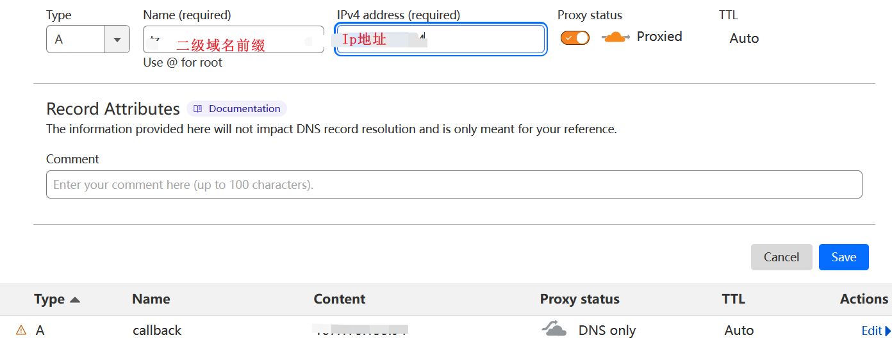
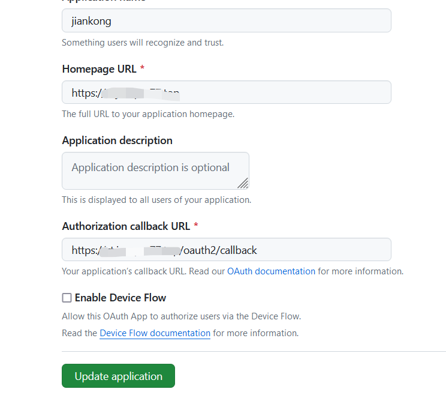

+++
title = '通过cloudflare直接访问哪吒探针'
date = 2024-06-29T14:02:09+08:00
tags = ["哪吒"]
showSummary = true
summary = "另一种搭建哪吒探针的方案"
featured_image = "/images/29-feature.jpg"

+++

## 准备一台vps

这一步并不过多说明，这是最基础的，如果不懂怎么购买vps，请google，购买合适自己的VPS。

## 用ssh工具登录并更新系统环境

### 更新vps系统环境：

```
apt update -y && apt install -y curl socat wget sudo
```

### 安装Docker：

```
curl -fsSL https://get.docker.com | sh
```

## 准备二个子域名并进行相关配置

域名托管到cf上，添加两个子域名解析，前端域名开启小云朵。如下图：



左侧Rules-Origin Rules，然后填写如下图信息：


完成后直接部署。

左侧SSL设置为“灵活”。


## GitHub上 创建一个 OAuth Apps

1.获取链接：[https://github.com/settings/developers](https://github.com/settings/developers)

2.添加一个New OAuth App

Application name：名称自定义

Homepage URL：前端地址

Authorization callback URL：前端地址+/oauth2/callback

如下图：

``

ps：**一定要https！！！**

## 一键安装哪吒监控面板

```
curl -L https://raw.githubusercontent.com/naiba/nezha/master/script/install.sh -o nezha.sh && chmod +x nezha.sh && sudo ./nezha.sh
```

至此就能直接用域名访问哪吒面板，省去反代这个步骤！

## cf一些特別設置

域名-`rules`-`Configuration Rules`


`Origin Rules`


## 配置TG通知

#### 配置telegram Bot

第一步，打开TG使用 @BotFather **start**


第二步，选择 **/newbot ，**输入bot的名字（可自定义），创建成功后可以获取到**HTTP API 需要的token**。


第三步，获取tg的id（要通知的人），使用 **@userinfobot** start后会获取到**Id**选项，将后面的**数字**复制出来


第四步，组装tg通知的API链接，将上图中的**HTTP_API_Token**、**Id**分别依次替换到下面的链接

```bash
https://api.telegram.org/bot{HTTP_API_Token}/sendMessage?chat_id={Id}&text=test
# 例如
https://api.telegram.org/bot11111111:BBC2xxxxxxxxxxxxxxxxxx/sendMessage?chat_id=2334508128&text=test
```

第五步，访问刚刚创建的tg bot点击**start**，如果需要bot**主动推送**，必须先与bot发生**消息往来**。

第六步，**测试**消息通知，浏览器访问上方拼接好的链接，如果拼接正确，刚刚创建的bot会主动给你发送test的消息内容。

#### 配置Dashbord主动预警

第一步，打开报警，添加通知方式。添加完之后会有一个首次添加后的测试消息。


第二步，**添加报警规则**。下方规则为测试用例

离线通知

```
[{"type":"offline","duration":10}]
```

cpu持续 10s 超过 50% 且 内存持续 20s 占用高于 80%

```
[{"type":"cpu","max":50,"duration":10},{"type":"memory","duration":20}]
```

疑似DDOS,双向网速持续10秒高于10MB/s

```
[{"type":"net_in_speed","max":10000000,"duration":10}]
```

